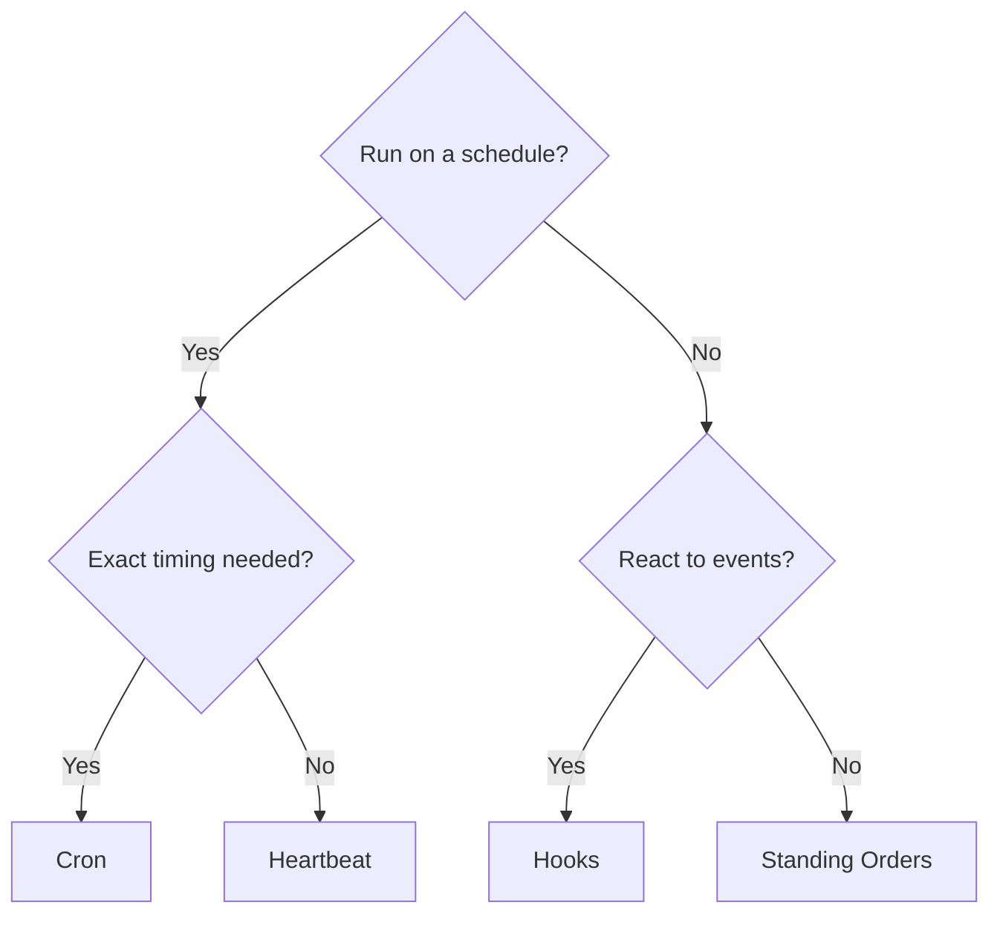

# 自动化

OpenClaw 提供了多种自动化机制，分别适用于不同用例。本页可帮助你选择合适的方式。

## 快速决策指南

## 机制速览

| Mechanism                               | 它的作用                                   | 运行位置         | 是否创建任务记录 |
| --------------------------------------- | ------------------------------------------ | ---------------- | ---------------- |
| [心跳](/gateway/heartbeat)              | 周期性主会话轮次，可将多项检查批量合并     | 主会话           | 否               |
| [定时任务](/automation/cron-jobs)       | 具备精确时间控制的计划任务                 | 主会话或隔离会话 | 是（所有类型）   |
| [后台任务](/automation/tasks)           | 跟踪分离式工作（cron、ACP、子智能体、CLI） | N/A（账本）      | N/A              |
| [钩子](/automation/hooks)               | 由智能体生命周期事件触发的事件驱动脚本     | Hook runner      | 否               |
| [常驻指令](/automation/standing-orders) | 注入到系统提示中的持久指令                 | 主会话           | 否               |
| [Webhook](/automation/webhook)          | 接收入站 HTTP 事件并路由给智能体           | Gateway HTTP     | 否               |

### 专用自动化

| Mechanism                                | 它的作用                               |
| ---------------------------------------- | -------------------------------------- |
| [Gmail PubSub](/automation/gmail-pubsub) | 通过 Google PubSub 获取 Gmail 实时通知 |
| [轮询](/automation/poll)                 | 定期检查数据源（RSS、API 等）          |
| [认证监控](/automation/auth-monitoring)  | 凭证健康状态与过期告警                 |

## 它们如何协同工作

最有效的配置通常会组合多种机制：

1. **心跳** 负责例行监控（收件箱、日历、通知），每 30 分钟在一次批处理轮次中完成。
2. **定时任务** 负责精确时间安排（日报、周检）以及一次性提醒。
3. **钩子** 对特定事件（工具调用、会话重置、压缩）做出响应，并运行自定义脚本。
4. **常驻指令** 为智能体提供持久上下文（例如“回复前始终检查项目看板”）。
5. **后台任务** 会自动跟踪所有分离式工作，便于你检查和审计。
6. **ClawFlow** 会在工作需要更高层级作业视图时，将相关的分离式任务归为同一条 flow。

如需了解两种调度机制的详细对比，请参见[定时任务与心跳对比](/automation/cron-vs-heartbeat)。

## ClawFlow

ClawFlow 位于[后台任务](/automation/tasks)之上。任务仍然负责跟踪分离式运行，而 ClawFlow 会将相关任务运行归并为一个可通过 CLI 检查或取消的作业。

请参见 [ClawFlow](/automation/clawflow) 了解 flow 概览，并参见 [CLI：flows](/cli/flows) 了解命令界面。

## 相关内容

- [定时任务与心跳对比](/automation/cron-vs-heartbeat) — 详细对比指南
- [ClawFlow](/automation/clawflow) — 位于任务之上的 flow 级编排
- [故障排除](/automation/troubleshooting) — 调试自动化问题
- [配置参考](/gateway/configuration-reference) — 所有配置键
