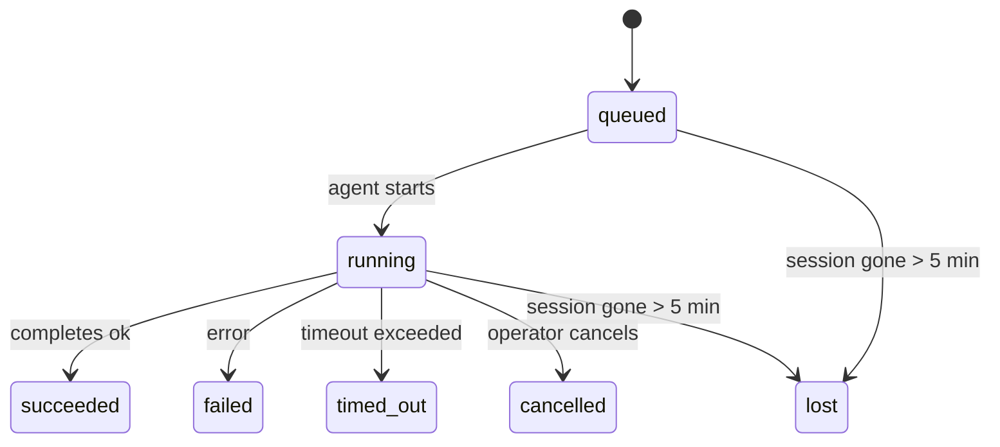

# 后台任务

> **定时任务 vs 心跳 vs 任务？** 选择合适的调度机制请参见[定时任务与心跳对比](/automation/cron-vs-heartbeat)。本页讲的是如何**跟踪**后台工作，而不是如何调度。

后台任务用于跟踪**主对话会话之外**运行的工作：
ACP 运行、子智能体生成、隔离式定时任务执行，以及由 CLI 发起的操作。

任务**不会**取代会话、定时任务或心跳 —— 它们是记录分离式工作“发生了什么、何时发生、是否成功”的**活动账本**。

<Note>
并非每次智能体运行都会创建任务。心跳轮次和普通交互式聊天不会。所有定时任务执行、ACP 生成、子智能体生成以及 CLI 智能体命令都会创建任务。
</Note>

## 简要概述

- 任务是**记录**，不是调度器 —— 定时任务和心跳决定工作**何时**运行，任务负责跟踪**发生了什么**。
- ACP、子智能体、所有定时任务以及 CLI 操作都会创建任务。心跳轮次不会。
- 每个任务都会经历 `queued → running → terminal`（`succeeded`、`failed`、`timed_out`、`cancelled` 或 `lost`）。
- 完成通知会直接投递到某个渠道，或排队等待下一次心跳发送。
- `openclaw tasks list` 显示所有任务；`openclaw tasks audit` 用于发现问题。
- 终态记录会保留 7 天，之后自动清理。

## 快速开始

```bash
# List all tasks (newest first)
openclaw tasks list

# Filter by runtime or status
openclaw tasks list --runtime acp
openclaw tasks list --status running

# Show details for a specific task (by ID, run ID, or session key)
openclaw tasks show <lookup>

# Cancel a running task (kills the child session)
openclaw tasks cancel <lookup>

# Change notification policy for a task
openclaw tasks notify <lookup> state_changes

# Run a health audit
openclaw tasks audit
```

## 什么会创建任务

| Source               | Runtime type | 何时创建任务记录                           | 默认通知策略 |
| -------------------- | ------------ | ------------------------------------------ | ------------ |
| ACP 后台运行         | `acp`        | 生成子 ACP 会话时                          | `done_only`  |
| 子智能体编排         | `subagent`   | 通过 `sessions_spawn` 生成子智能体时       | `done_only`  |
| 定时任务（所有类型） | `cron`       | 每次定时任务执行时（主会话和隔离式都包括） | `silent`     |
| CLI 操作             | `cli`        | 通过 gateway 运行的 `openclaw agent` 命令  | `done_only`  |

主会话定时任务默认使用 `silent` 通知策略 —— 它们会创建记录以供跟踪，但不会生成通知。隔离式定时任务也默认使用 `silent`，但因为它们在独立会话中运行，所以可见性更高。

**以下情况不会创建任务：**

- 心跳轮次 —— 属于主会话；参见[心跳](/gateway/heartbeat)
- 普通交互式聊天轮次
- 直接的 `/command` 响应

## 任务生命周期



| Status      | 含义                                      |
| ----------- | ----------------------------------------- |
| `queued`    | 已创建，正在等待智能体启动                |
| `running`   | 智能体轮次正在执行                        |
| `succeeded` | 已成功完成                                |
| `failed`    | 执行出错并结束                            |
| `timed_out` | 超出了配置的超时时间                      |
| `cancelled` | 由操作员通过 `openclaw tasks cancel` 停止 |
| `lost`      | 后端子会话消失（在 5 分钟宽限期后检测到） |

这些状态转换都会自动发生 —— 当关联的智能体运行结束后，任务状态会自动同步更新。

## 投递与通知

当任务进入终态时，OpenClaw 会通知你。存在两种投递路径：

**直接投递** —— 如果任务具有渠道目标（即 `requesterOrigin`），完成消息会直接发送到该渠道（Telegram、Discord、Slack 等）。

**会话排队投递** —— 如果直接投递失败，或未设置 origin，则更新会作为系统事件排入请求者的会话，并在下一次心跳时显示。

<Tip>
任务完成后会立即触发一次心跳唤醒，因此你无需等到下一次计划心跳，也能很快看到结果。
</Tip>

### 通知策略

你可以控制每个任务的通知密度：

| Policy                | 会投递什么内容                                      |
| --------------------- | --------------------------------------------------- |
| `done_only` (default) | 只投递终态（succeeded、failed 等）—— **这是默认值** |
| `state_changes`       | 每次状态变化和进度更新                              |
| `silent`              | 完全不投递                                          |

在任务运行期间修改策略：

```bash
openclaw tasks notify <lookup> state_changes
```

## CLI 参考

### `tasks list`

```bash
openclaw tasks list [--runtime <acp|subagent|cron|cli>] [--status <status>] [--json]
```

输出列包括：Task ID、Kind、Status、Delivery、Run ID、Child Session、Summary。

### `tasks show`

```bash
openclaw tasks show <lookup>
```

查找标识可以是 task ID、run ID 或 session key。会显示完整记录，包括时间、投递状态、错误和终态摘要。

### `tasks cancel`

```bash
openclaw tasks cancel <lookup>
```

对于 ACP 和子智能体任务，这会终止子会话。状态会切换为 `cancelled`，并发送投递通知。

### `tasks notify`

```bash
openclaw tasks notify <lookup> <done_only|state_changes|silent>
```

### `tasks audit`

```bash
openclaw tasks audit [--json]
```

用于发现运行问题。检测结果在有问题时也会出现在 `openclaw status` 中。

| Finding                   | Severity | 触发条件                                 |
| ------------------------- | -------- | ---------------------------------------- |
| `stale_queued`            | warn     | 排队超过 10 分钟                         |
| `stale_running`           | error    | 运行超过 30 分钟                         |
| `lost`                    | error    | 后端会话已消失                           |
| `delivery_failed`         | warn     | 投递失败且通知策略不是 `silent`          |
| `missing_cleanup`         | warn     | 终态任务没有 cleanup 时间戳              |
| `inconsistent_timestamps` | warn     | 时间线不一致（例如结束时间早于开始时间） |

## 聊天任务看板（`/tasks`）

在任意聊天会话中使用 `/tasks`，即可查看关联到当前会话的后台任务。该面板会显示活跃任务和最近完成的任务，包括运行时类型、状态、时间以及进度或错误详情。

当当前会话没有可见的关联任务时，`/tasks` 会回退为智能体本地任务统计，这样你依然能获得整体概览，而不会泄露其他会话的细节。

如果你想查看完整的操作员任务账本，请使用 CLI：`openclaw tasks list`。

## 状态集成（任务压力）

`openclaw status` 会包含一份任务摘要：

```
Tasks: 3 queued · 2 running · 1 issues
```

该摘要会报告：

- **active** —— `queued` + `running` 的数量
- **failures** —— `failed` + `timed_out` + `lost` 的数量
- **byRuntime** —— 按 `acp`、`subagent`、`cron`、`cli` 分组统计

`/status` 与 `session_status` 工具都会使用带清理感知的任务快照：优先显示活跃任务，隐藏陈旧的已完成记录，只有在不存在活跃工作时才显示最近失败。这让状态卡片始终聚焦当下最重要的内容。

## 存储与维护

### 任务存储位置

任务记录会持久化到 SQLite：

```
$OPENCLAW_STATE_DIR/tasks/runs.sqlite
```

registry 会在 gateway 启动时加载到内存中，并同步写回 SQLite，以便在重启后仍能保留。

### 自动维护

每 **60 秒** 会运行一次 sweeper，负责三件事：

1. **对账** —— 检查活跃任务对应的后端会话是否仍然存在。如果子会话消失超过 5 分钟，则任务会被标记为 `lost`。
2. **清理时间戳补写** —— 为终态任务设置 `cleanupAfter` 时间戳（`endedAt + 7 days`）。
3. **清理过期记录** —— 删除已超过 `cleanupAfter` 的记录。

**保留期**：终态任务记录会保留 **7 天**，之后自动清除。无需配置。

## 任务与其他系统的关系

### 任务与 ClawFlow

ClawFlow 是位于任务之上的 flow 层。一个 flow 可以将一个或多个任务运行归并为单个作业，持有父会话上下文，并为阻塞型或多步骤工作提供更高层级的控制界面。

请参见 [ClawFlow](/automation/clawflow) 了解 flow 概览，并参见 [CLI：flows](/cli/flows) 了解命令界面。

### 任务与定时任务

定时任务**定义**保存在 `~/.openclaw/cron/jobs.json` 中。**每一次**定时任务执行都会创建任务记录 —— 主会话与隔离式执行都一样。主会话定时任务默认使用 `silent` 通知策略，因此只跟踪、不发通知。

参见[定时任务](/automation/cron-jobs)。

### 任务与心跳

心跳运行属于主会话轮次 —— 不会创建任务记录。当任务完成时，它可以触发一次心跳唤醒，以便你及时看到结果。

参见[心跳](/gateway/heartbeat)。

### 任务与会话

一个任务可能会引用 `childSessionKey`（工作实际运行的会话）和 `requesterSessionKey`（发起该任务的人）。会话负责对话上下文，任务则在其之上负责活动跟踪。

### 任务与智能体运行

任务的 `runId` 会关联到执行工作的智能体运行。智能体生命周期事件（启动、结束、错误）会自动更新任务状态 —— 你无需手动管理生命周期。

## 相关内容

- [自动化概览](/automation) — 所有自动化机制一览
- [ClawFlow](/automation/clawflow) — 位于任务之上的作业级编排
- [定时任务](/automation/cron-jobs) — 调度后台工作
- [定时任务与心跳对比](/automation/cron-vs-heartbeat) — 选择合适的机制
- [心跳](/gateway/heartbeat) — 周期性主会话轮次
- [CLI：flows](/cli/flows) — flow 检查与控制命令
- [CLI：Tasks](/cli/index#tasks) — CLI 命令参考
