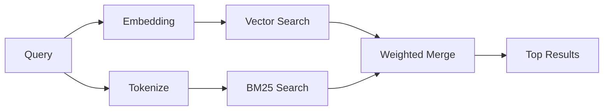

# 记忆搜索

`memory_search` 可以从你的记忆文件中找到相关笔记，即使查询措辞与原文不同也可以。它会先把记忆切分为较小片段，再通过嵌入、关键词或两者结合进行搜索。

## 快速开始

如果你已经配置了 OpenAI、Gemini、Voyage 或 Mistral API key，记忆搜索会自动工作。若要显式指定提供商：

```json5
{
  agents: {
    defaults: {
      memorySearch: {
        provider: "openai", // or "gemini", "local", "ollama", etc.
      },
    },
  },
}
```

如果想使用无需 API key 的本地嵌入，可设置 `provider: "local"`（需要 node-llama-cpp）。

## 支持的提供商

| Provider | ID        | Needs API key | Notes                         |
| -------- | --------- | ------------- | ----------------------------- |
| OpenAI   | `openai`  | Yes           | Auto-detected, fast           |
| Gemini   | `gemini`  | Yes           | Supports image/audio indexing |
| Voyage   | `voyage`  | Yes           | Auto-detected                 |
| Mistral  | `mistral` | Yes           | Auto-detected                 |
| Ollama   | `ollama`  | No            | Local, must set explicitly    |
| Local    | `local`   | No            | GGUF model, ~0.6 GB download  |

## 搜索工作原理

OpenClaw 会并行运行两条检索路径，然后合并结果：



- **向量搜索** 用于查找语义相近的笔记（例如“gateway host”可以匹配“the machine running OpenClaw”）。
- **BM25 关键词搜索** 用于查找精确匹配项（ID、错误字符串、配置键名）。

如果只有一条路径可用（没有嵌入或没有 FTS），则只运行另一条路径。

## 提升搜索质量

当你的笔记历史较大时，有两个可选功能会很有帮助：

### 时间衰减

旧笔记会逐渐降低排序权重，让最近的信息更容易排到前面。默认半衰期为 30 天，因此上个月的笔记分值会降到原来的 50%。像 `MEMORY.md` 这样的常青文件则永远不会衰减。

<Tip>
如果你的智能体已经积累了数月的日常笔记，而旧信息总是压过近期上下文，请启用时间衰减。
</Tip>

### MMR（多样性）

用于减少重复结果。如果五条笔记都提到同一份路由器配置，MMR 会确保靠前的结果覆盖不同主题，而不是重复相似内容。

<Tip>
如果 `memory_search` 总是从不同日常笔记中返回几乎重复的片段，请启用 MMR。
</Tip>

### 同时启用两者

```json5
{
  agents: {
    defaults: {
      memorySearch: {
        query: {
          hybrid: {
            mmr: { enabled: true },
            temporalDecay: { enabled: true },
          },
        },
      },
    },
  },
}
```

## 多模态记忆

配合 Gemini Embedding 2，你可以在 Markdown 之外索引图像和音频文件。搜索查询仍然是文本，但会匹配视觉和音频内容。配置方法请参阅[记忆配置参考](/reference/memory-config)。

## 会话记忆搜索

你还可以选择索引会话转录，让 `memory_search` 能够回忆更早的对话。这是通过 `memorySearch.experimental.sessionMemory` 选择启用的。详情请参阅[配置参考](/reference/memory-config)。

## 故障排除

**没有结果？** 运行 `openclaw memory status` 检查索引。如果索引为空，请运行 `openclaw memory index --force`。

**只有关键词命中？** 你的嵌入提供商可能还没有配置好。检查 `openclaw memory status --deep`。

**找不到 CJK 文本？** 使用 `openclaw memory index --force` 重建 FTS 索引。

## 延伸阅读

- [记忆](/concepts/memory) —— 文件布局、后端与工具
- [记忆配置参考](/reference/memory-config) —— 所有配置项
